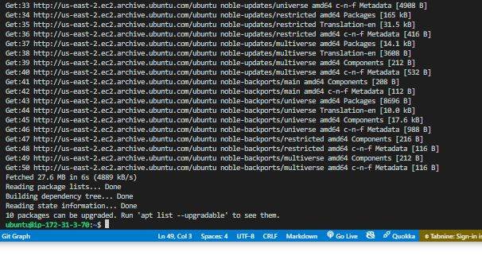
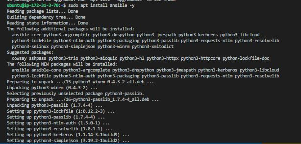
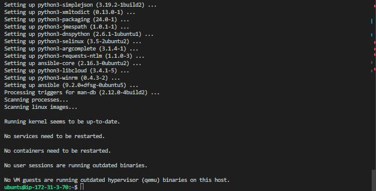

# **Project 1 - Ansible Web-Server Lab Guide**

## Objective:

- The objective of this lab is to use Ansible to provision and configure two web servers (one running Nginx and the other running Apache) with custom HTML files. Additionally, we will install Wireshark on both servers for network monitoring purposes.

## Prerequisites:

- Ansible installed on a control node.
- Access to two target machines for provisioning Nginx and Apache servers.
- SSH access is configured between the control node and target machines.
- Basic knowledge of Ansible playbooks and YAML syntax.

## Lab Setup:

1. Control Node Setup:

- Set up a virtual machine or cloud instance as the Ansible control node.
- Install Ansible on the control node:
  
  
  

2. Create Playbooks:

- Create separate playbooks for Nginx, Apache, and Wireshark installation:
  - nginx.yml: Installs Nginx and deploys a custom HTML file.
  - apache.yml: Installs Apache and deploys a custom HTML file.
  - wireshark.yml: Installs Wireshark.
  - main.yml: Imports the above playbooks.
